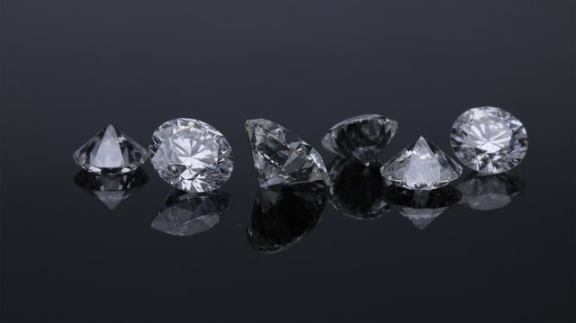

# Diamonds

  
"[Diamonds](https://unsplash.com/photos/gb0BZGae1Nk)" by [Edgar Soto](https://unsplash.com/@edgardo1987) is licensed under [Unsplash License](https://unsplash.com/license)

## Description

Available [here](https://codingdojo.org/kata/Diamond/)

## Getting Started

- [Java](java/GETTING_STARTED.md)
- [C++](cpp/GETTING_STARTED.md)
- [Go](go/GETTING_STARTED.md)
- [Python](python/GETTING_STARTED.md)

## Session Quick Retrospective

You can fill it from [here](QuickRetrospective.md)

## Useful Links

### For this Kata

- N/A

### General

- [TCR (Test && Commit || Revert) wrapper](tcr/TCR.md) utility
- Collaborative timer for pairing or mobbing:
  [mobti.me](https://mobti.me/)
  or [agility timer](https://agility.jahed.dev/)

## Session Information

### Style & Duration

- 2-hour [Randori Kata](doc/RandoriKata.md)

### Topic

- Top-down TDD

### Focus Points

- Baby Steps
- YAGNI
- Code Smells
- Refactor on green bar

### Source Files

- [Java](java)
- [C++](cpp)
- [Go](go)
- [Python](python)

## License

`Kata-Diamonds` and the accompanying materials are made available
under the terms of the [MIT License](LICENSE.md) which accompanies this
distribution, and is available at the [Open Source site](https://opensource.org/licenses/MIT)

## Acknowledgements

See [ACKNOWLEDGEMENTS.md](ACKNOWLEDGEMENTS.md) for more information.

## Contributors

<table>
<tr>
    <td align="center" style="word-wrap: break-word; width: 150.0; height: 150.0">
        <a href=https://github.com/mengdaming>
            
             
            <b>Damien Menanteau</b>
        </a>
    </td>
    <td align="center" style="word-wrap: break-word; width: 150.0; height: 150.0">
        <a href=https://github.com/aatwi>
            
             
            <b>Ahmad Atwi</b>
        </a>
    </td>
    <td align="center" style="word-wrap: break-word; width: 150.0; height: 150.0">
        <a href=https://github.com/AntoineMx>
            
             
            <b>AntoineMx</b>
        </a>
    </td>
</tr>
</table>
